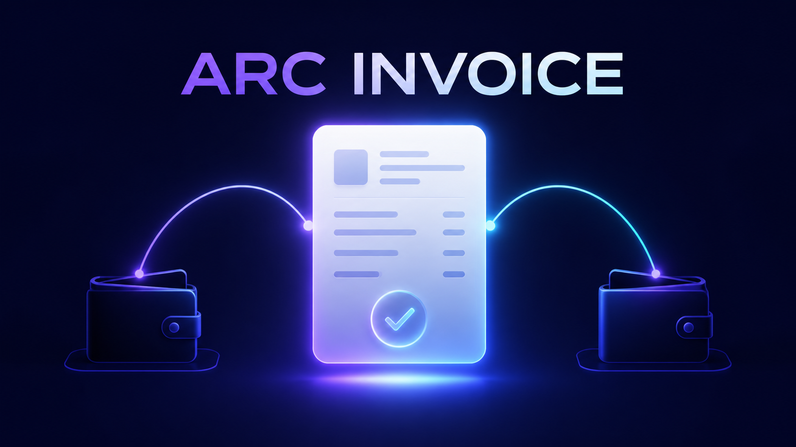

# ArcInvoice — Arc Testnet payment QA

A static, open-source USDC invoice and payment-quality tool for **Arc Testnet**. It combines a user-approved payment flow with read-only verification, wallet compatibility checks, and reproducible RPC diagnostics.

> **Testnet only.** ArcInvoice never receives or stores a private key. A user must review the recipient and amount in their own wallet before any payment can be submitted.

**Live app:** [arcinvoice-ashen.vercel.app](https://arcinvoice-ashen.vercel.app)

**Network:** Arc Testnet · chain ID `5042002`

## What it includes

- **Native-USDC invoice payment:** The payer enters a recipient and amount, then approves the payment in their own Arc Testnet wallet.
- **Shareable invoice links:** Recipient, amount, and optional memo are encoded in a URL for convenient sharing. The link cannot sign or submit a payment.
- **Read-only payment verifier:** Paste an Arc Testnet transaction hash to view status, amount, sender, recipient, block, time, and an ArcScan link. No wallet connection is required.
- **Payment QA bundles:** Each verified transaction can create a structured JSON record for reproducible test feedback. Recent runs remain only in the browser unless the user downloads them.
- **Wallet Compatibility Lab:** Checks injected-wallet availability, read-only account access, selected chain, and primary Arc RPC connectivity. It never requests a signature or puts an address in the exported report.
- **RPC Resilience Matrix:** Compares Arc's official Primary, Blockdaemon, dRPC, and QuickNode endpoints using `eth_chainId` and `eth_blockNumber`. It shows chain consistency, block difference, browser-observed response time, and a sanitized JSON export.
- **Network Readiness Console:** Runs the network diagnostic, wallet compatibility check, and RPC Resilience Matrix together, then creates one sanitized JSON bundle for reproducible technical feedback. It clearly flags a wrong wallet chain without requesting a signature or transaction.

## Architecture

This is a static, client-side application. It uses public Arc Testnet JSON-RPC for read-only data and an injected EVM wallet only after the user explicitly connects or submits a payment.

| Flow | Arc JSON-RPC method |
| --- | --- |
| Latest network block | `eth_blockNumber` |
| Transaction lookup | `eth_getTransactionByHash` |
| Final payment status | `eth_getTransactionReceipt` |
| Transaction timestamp | `eth_getBlockByNumber` |

The Resilience Matrix additionally calls `eth_chainId` and `eth_blockNumber` against Arc's four official RPC endpoints. Timing values are browser observations, **not** network performance benchmarks.

ArcScan is linked for independent transaction inspection; it is not used as the data source.

## Make a testnet payment

1. Open the site and click **Get test USDC**.
2. On the Circle Faucet, select **Arc Testnet**, paste your wallet address, and request test USDC.
3. Back on the site, enter the recipient wallet and amount.
4. Click **Connect wallet to pay**, then approve the request in your wallet.

The code makes a direct native USDC payment on Arc Testnet, then links the submitted transaction on ArcScan. On Arc, native sends and the USDC ERC-20 interface move the same underlying USDC balance. Never put a private key in this project and never use mainnet funds.

## Arc Testnet

| Setting | Value |
| --- | --- |
| Chain ID | `5042002` |
| Primary RPC | `https://rpc.testnet.arc.io` |
| Additional RPCs | Blockdaemon, dRPC, QuickNode — tested by the in-app Resilience Matrix |
| Gas token | USDC (6 display decimals; native transaction values use 18 decimals) |
| Explorer | https://testnet.arcscan.app |
| Faucet | https://faucet.circle.com |

The Connect Wallet button asks an injected wallet such as MetaMask to add Arc Testnet. Official network setup: [Connect to Arc](https://docs.arc.io/arc/references/connect-to-arc).

## QA checklist

| Scenario | Expected result |
| --- | --- |
| Valid Arc Testnet USDC transaction hash | Displays finalized status and transaction details |
| Unknown or wrong-network hash | Shows a clear “not found” message |
| Malformed hash | Validates the input without making an RPC request |
| Shared invoice link | Prefills recipient, amount, and memo; does not connect a wallet |
| Wallet connection cancelled | Shows a clear cancellation message; no payment is sent |
| Payment rejected in wallet | Shows an action-needed message; no payment is sent |
| No injected wallet | Compatibility Lab explains that a wallet is required; the app does not crash |
| Wrong wallet chain | Compatibility Lab reports the selected chain and offers a switch to Arc Testnet |
| RPC endpoint drift | Resilience Matrix records chain ID, latest block, block difference, and sanitized errors |

## Privacy and safety

- No seed phrase, private key, signature, or payment approval is requested for verification or QA tools.
- Wallet reports redact addresses and only contain compatibility results and sanitized errors.
- RPC reports are read-only and do not include wallet data.
- The payment flow is testnet-only; never use mainnet funds in this demo.

## Feedback welcome

Useful feedback includes reproducible wallet connection issues, wrong-network behavior, pending/failed payment receipts, and RPC inconsistency reports. Please include the exported JSON report when available and never include a seed phrase or private key.

## License

MIT
